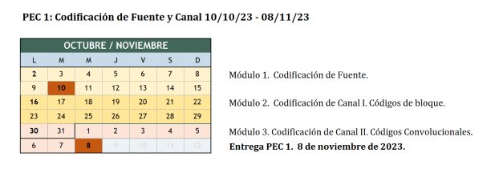
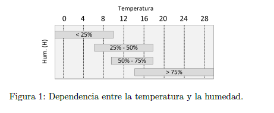

# Master Universitario de Ingeniería en Telecomunicaciones.

# 81.618 Codificaciones y modulaciones avanzadas - PEC1.

# José Enrique Rodríguez González.

## Presentación.

Esta PEC evalúa la primera parte de la asignatura Codificación de Fuente y Canal correspondiente al trabajo realizado en los módulos 1, 2 y 3. Está estructurada en diferentes partes y cada una tiene por objetivo evaluar los conocimientos adquiridos en uno del módulos a pesar de que encontraréis algunas cuestiones generales dado que uno de los objetivos de la PEC es que sinteticéis los conocimientos de los tres módulos.

---

## Competencias.

- Capacidad para construir, explotar y gestionar las redes, servicios, procesos y aplicaciones de telecomunicaciones, entendidas estas como sistemas de captación, transporte,  representación, procesamiento, almacenamiento, gestión y presentación de información multimedia, desde el punto de vista de los sistemas de transmisión.

- Capacidad para analizar, codificar, procesar y transmitir información multimedia empleando técnicas de procesado analógico y digital de señal.

---

## Objetivos.

- Evaluar la capacidad de diseñar un codificador de fuente PCM, un codificador diferencial, un codificador de Huffman, y entender el funcionamiento de un codificador con pérdidas (JPEG).

- Evaluar los conocimientos sobre codificadores de canal basados en códigos de bloque y códigos convolucionales.

- Evaluar la capacidad de resolver problemas sencillos de codificación y descodificación de secuencias incluyendo algunos códigos de canal y fuente presentados en los módulos 1, 2 y 3 de la asignatura
- Potenciar que el estudiante integre/sintetice mediante esta PEC (y a partir de un caso simplificado) los bloques de codificación de fuente y codificador de canal estudiados de forma aislada.

---

## Descripción de la PEC.

La PEC es extensa puesto que evalúa casi la mitad de la asignatura. Sin embargo está diseñada para que la podáis ir resolviendo a medida que vais finalizando el estudio de cada uno de los módulos. Así mismo, la mayoría de los ejercicios están planteados de forma que errores en apartados anteriores o apartados no resueltos, no condicionen que no podáis resolver satisfactoriamente el resto de la PEC. Dada su extensión, disponéis de cuatro semanas para resolverla. Se recomienda no dejar todo el trabajo para el final.

---

## Recursos.

**Recursos Básicos**

- Guías de estudio: GES1, GES2 i GES3.

- Materiales didácticos: Módulo 1, Módulo 2 y Módulo 3.

---

## Recursos Complementarios.

- Bibliografía básica y complementaria referenciada en los materiales didácticos

---

## Criterios de valoración.

Las respuestas tienen que estar debidamente justificadas y **sólo se valorarán las respuestas que se hayan justificado correctamente**.

La resolución de la cuarta parte, correspondiente a un ejercicio práctico, es opcional. El objetivo es doble, que podáis profundizar en un ejemplo práctico de compresión con pérdidas y a la vez aprendáis alguna noción sobre cómo funciona este tipo de compresión. Los alumnos que realicen la parte práctica se evaluará y se tendrá en cuenta favorablemente al final de curso para redondear la nota final del EC (siempre al alza). No se evaluará la práctica si os limitáis a adjuntar capturas de pantalla sin comentarios o con comentarios muy escuetos que no demuestren que habéis trabajado y entendido los resultados.

---

## Formato y fecha de entrega.

Se tiene que entregar la PEC **"en el apartado de registro de evaluación continua"** de vuestra aula.

Preferiblemente entregad el documento en PDF y comprobad que todas las ecuaciones se ven correctamente. Es posible incluir imágenes escaneadas de documentos elaborados a mano. En este caso, intentad cuidar al máximo la letra y la organización del documento. Si se desea se puede entregar en PDF y en formato Office. Se recomienda no realizar la entrega sólo en formato Word puesto que no siempre las fórmulas se mantienen en todas las versiones.

**Las páginas tienen que estar numeradas y vuestro nombre y apellidos también tiene que aparecer en la parte superior de cada una de las páginas del documento.**

---

## Índice

- [Enunciado](#enunciado)
- [Parte 1. Codificación de Fuente.](#parte-1-codificación-de-fuente)
- [Ejercicio 1.1.](#ejercicio-11)
- [Pregunta 1.1.1.](#pregunta-111)
- [Respuesta a la pregunta 1.1.1.](#respuesta-a-la-pregunta-111)
- [Pregunta 1.1.2.](#pregunta-112)
- [Respuesta a la pregunta 1.1.2.](#respuesta-a-la-pregunta-112)
- [Ejercicio 1.2.](#ejercicio-12)
- [Pregunta 1.2.1.](#pregunta-121)
- [Respuesta a la pregunta 1.2.1.](#respuesta-a-la-pregunta-121)
- [Pregunta 1.2.2.](#pregunta-122)
- [Respuesta a la pregunta 1.2.2.](#respuesta-a-la-pregunta-122)
- [Pregunta 1.2.3.](#pregunta-123)
- [Respuesta a la pregunta 1.2.3.](#respuesta-a-la-pregunta-123)
- [Pregunta 1.2.4.](#pregunta-124)
- [Respuesta a la pregunta 1.2.4.](#respuesta-a-la-pregunta-124)
- [Ejercicio 1.3.](#ejercicio-13)
- 
- 
- 
- 
- 
- 
- 
- 

---

## Enunciado.

**Introducción**

Como se describe en la introducción del módulo 1, el envío o almacenamiento de información resulta eficiente en la medida de que somos capaces de compactar los datos de información. Esta capacidad de compresión tenemos que poder desarrollarla sobre los datos de cualquier fuente de información (voz, imágenes y datos) que se transmite de forma habitual a través de las redes de comunicaciones o se almacena para su posterior recuperación. Del mismo modo, como se plantea en los módulos 2 y 3, los datos habrá que protegerlos frente a los errores que inevitablemente se producen en todo proceso de transmisión o lectura/escritura (almacenamiento y recuperación de la información). En esta PEC trabajaremos todo este proceso. En la primera parte de la PAC trabajaremos la codificación de la se˜nal obtenida de una fuente. En la segunda parte de la PAC se analizará un esquema de codificación de bloque. La tercera parte de la PAC propondrá el estudio de esquemas FEC de corrección de errores basados en un código convolucional. Finalmente, la última parte de la PAC propondrá una práctica (de trabajo opcional) que se basará en la compresión de datos (imágenes) con pérdidas.

[Volver al Índice](#índice)

---

## Parte 1. Codificación de Fuente.

En esta primera parte estudiaremos la codificación de la información extraída a partir de dos sensores ambientales, uno de temperatura y otro de humedad ubicados en una habitación que se desea monitorear. Asumiremos que el rango de temperaturas a sensar está comprendida entre una $T_{min}=-2ºC$ y una $T_{max}=30ºC$. Respecto a la humedad no la sensaremos con demasiada precisión sólo nos interesará saber si ésta es muy baja $(H < 25 %)$, baja $(H ∈ [25 %, 50 %])$, alta $(H ∈ [50 %, 75 %])$ o muy alta $(H > 75 %)$. Para terminar de especificar el sensado de las fuentes hay que saber que se decide tomar una muestra de los sensores cada minuto (60 muestras por hora).

[Volver al Índice](#índice)

---

# Ejercicio 1.1.

Empezaremos realizando algunos cálculos sobre el sensado de la temperatura (olvidaremos de momento el sensado de la humedad). Asumiremos que se utilizan tres bits para sensar la temperatura,
de forma que $T = {0\text{ ◦C}, 4 \text{ ◦C}, 8 \text{ ◦C}, 12 \text{ ◦C}, 16 \text{ ◦C}, 20 \text{ ◦C}, 24\text{ ◦C}, 28\text{ ◦C}}$ serán las 8 posibles temperaturas
cuantificadas. A partir de la información de sensado descrita en el párrafo anterior responded a las
siguientes cuestiones:

[Volver al Índice](#índice)

---

## Pregunta 1.1.1.

- Si sólo se sensa la temperatura, indicad la tasa de bits en bits por segundo. (Nota: Dada la
baja velocidad de muestreo obtendréis un valor muy bajo).

[Volver al Índice](#índice)

---

## Respuesta a la pregunta 1.1.1.

Para calcular la tasa de bits en bits por segundo (bps) necesitamos saber cuántos bits se generan en un período de tiempo y cómo se relaciona ese período con un segundo.

Según la información proporcionada, la temperatura se muestrea una vez por minuto y se utiliza un sistema de codificación que utiliza 3 bits para representar uno de los 8 posibles valores de temperatura. Esto significa que cada muestra de temperatura genera 3 bits de información.

Dado que hay 60 segundos en un minuto y se toma una muestra por minuto, la tasa de bits sería de:

$\frac{3 \text{ bits por muestra}}{60 \text{ segundos}} = 0,05 \text{ bits por segundo (bps)}$

[Volver al Índice](#índice)

---

## Pregunta 1.1.2.

¿Cuál será la secuencia de bits obtenida si la secuencia de temperaturas es $T^a(t)=\{12 ; 13; 15; 16; 14,5; 12,5\}$.

[Volver al Índice](#índice)

---

## Respuesta a la pregunta 1.1.2.

Para convertir la secuencia de temperaturas $T^a(t)=\{12 ; 13; 15; 16; 14,5; 12,5\}$ a una secuencia de bits utilizando el sistema de codificación de temperatura dado $T = {0\text{ ◦C}, 4 \text{ ◦C}, 8 \text{ ◦C}, 12 \text{ ◦C}, 16 \text{ ◦C}, 20 \text{ ◦C}, 24\text{ ◦C}, 28\text{ ◦C}}$ con 3 bits, debemos cuantificar cada temperatura en el valor más cercano que puede ser representado por esos 3 bits.

La cuantificación y la codificación se haría de la siguiente manera:

- $12 \text{ ◦C}$ se cuantifica como $12 \text{ ◦C}$ (el valor exacto está disponible), que se codifica como $011$ en 3 bits.

- $12,5 \text{ ◦C}$ se cuantifica como $12 \text{ ◦C}$  (el valor más cercano disponible), que se codifica como $011$ en 3 bits.

- $13 \text{ ◦C}$ se cuantifica como $12 \text{ ◦C}$  (el valor más cercano disponible), que se codifica como $011$ en 3 bits.

- $14,5 \text{ ◦C}$ se cuantifica como $16 \text{ ◦C}$ (el valor más cercano disponible), que se codifica como $100$ en 3 bits.

- $15 \text{ ◦C}$ se cuantifica como $16 \text{ ◦C}$ (el valor más cercano disponible), que se codifica como $100$ en 3 bits.

- $16 \text{ ◦C}$ se cuantifica como $16 \text{ ◦C}$ (el valor exacto está disponible), que se codifica como $100$ en 3 bits.

Ahora mismo la secuencia esta ordenada por temperaturas, pero no por la secuencia, por lo que hay que ordenar la secuencia según $T^a(t)$, que en nuestro caso será:

$011;011;100;100;100;011$

[Volver al Índice](#índice)

---

# Ejercicio 1.2.

Teniendo en cuenta que los diferentes valores de temperatura son equiprobables, y que la temperatura de la sala en un minuto no varía más de 2ºC (arriba o abajo).

[Volver al Índice](#índice)

---

## Pregunta 1.2.1.

Calculad la entropía de la fuente.

[Volver al Índice](#índice)

---

## Respuesta a la pregunta 1.2.1.

La entropía de una fuente es una medida de la incertidumbre o la cantidad promedio de información por cada símbolo que se produce por la fuente. Para un conjunto de posibles eventos (en este caso, las temperaturas), la entropía $H$ se calcula utilizando la fórmula de Shannon:

$H = - \sum_{i=1}^{n} p(x_i) \log_2 p(x_i)$

donde $p(x_i)$ es la probabilidad del evento $x_i$ y $n$ es el número de posibles eventos.

Si todas las temperaturas son equiprobables, cada temperatura tiene una probabilidad de $\frac{1}{8}$. Por lo tanto, la entropía se calcula como:

$H = - \sum_{i=1}^{8} \left(\frac{1}{8}\right) \log_2 \left(\frac{1}{8}\right)$

$H = - 8 \times \left(\frac{1}{8}\right) \times \log_2 \left(\frac{1}{8}\right)$

$H = - \log_2 \left(\frac{1}{8}\right)$

Dado que $\log_2 (1/8)=\log_2 (2^{-3})$, y por las propiedades de los logaritmos $\log_b (a^c) = c \log_b (a)$, tenemos:

$H = 3 \times \log_2 (2)$

$H = 3$

La entropía de la fuente es de 3 bits por símbolo, lo que significa que en promedio cada muestra de temperatura lleva 3 bits de información.

[Volver al Índice](#índice)

---

## Pregunta 1.2.2.

Justificad por qué un codificador diferencial sería más adecuado que un codificador entrópico para comprimir la información sin pérdidas.

[Volver al Índice](#índice)

---

## Respuesta a la pregunta 1.2.2.

Un codificador diferencial es a menudo más adecuado que un codificador entrópico para comprimir datos que tienen una correlación temporal, especialmente cuando los cambios entre los valores sucesivos son pequeños en comparación con el rango completo de posibles valores. Esto se debe a varias razones:

1. **Reducción de la Varianza.**

En muchos procesos físicos, incluyendo la medición de la temperatura en una habitación, los valores sucesivos no varían drásticamente en periodos cortos de tiempo. Al codificar las diferencias entre las mediciones consecutivas en lugar de los valores absolutos, es probable que las diferencias sean menores que los valores absolutos, y por lo tanto se puedan representar con menos bits.

2. **Mejor Compresión.**

Debido a que las diferencias entre las muestras consecutivas son pequeñas, un codificador diferencial puede asignar códigos más cortos a las diferencias más frecuentes y pequeñas, lo que resulta en una tasa de compresión más alta.

3. **Adaptabilidad.**

Los codificadores diferenciales son buenos para adaptarse a los cambios lentos en los niveles de señal, lo que puede resultar en una mejor compresión sin pérdida a lo largo del tiempo.

4. **Eficiencia en la Codificación Entropía.**

Un codificador entrópico como el de Huffman o aritmético funcionará mejor cuando hay una gran diferencia en las probabilidades de los símbolos. Sin embargo, si cada temperatura es equiprobable y las diferencias entre valores consecutivos son pequeñas, el codificador entrópico no proporcionará mucha compresión sobre los datos ya que cada diferencia tiene una alta probabilidad de ocurrencia y, por lo tanto, se asignaría a códigos de longitud similar.

5. **Simplicidad en el Decodificador.**

Para decodificar un flujo de datos comprimido con codificación diferencial, el decodificador simplemente suma las diferencias sucesivas al valor inicial para recuperar los valores originales. Esto es más directo que el decodificar una estructura de datos entrópica, que puede ser más compleja.

6. **Robustez contra Errores.**

En algunos casos, un error en un codificador entrópico puede propagarse y causar la pérdida de una gran cantidad de datos subsiguientes. En cambio, en un codificador diferencial, un error solo afecta dos valores: el valor en el que se produjo el error y el siguiente valor calculado.

***Conclusión***

Para la tarea de compresión sin pérdidas de datos de temperatura de una habitación, donde las fluctuaciones son limitadas, un codificador diferencial es particularmente apropiado. Aprovecha la naturaleza de las variaciones de temperatura, que suelen ser pequeñas en intervalos cortos, para proporcionar una compresión eficiente. Al contrastarlo con un codificador entrópico, el cual no ofrece ventajas significativas en un contexto de probabilidades uniformes y diferencias mínimas, se destaca la eficiencia de la codificación diferencial en términos de simplicidad, robustez y capacidad de compresión. Por lo tanto, para el caso específico de la monitorización de la temperatura ambiente en una habitación, la codificación diferencial no solo es más adecuada, sino que también asegura la integridad de los datos a través de una recuperación fiable en el proceso de decodificación.

[Volver al Índice](#índice)

---

## Pregunta 1.2.3.

Si haciendo uso del codificador diferencial mantenemos la codificación de la temperatura con tres bits no habrá compresión de la información (la tasa de bits sería la misma que la calculada en la cuestión 1.1.2). Indicad en este caso cuál seria el beneficio de utilizar el codificador diferencial.

[Volver al Índice](#índice)

---

## Respuesta a la pregunta 1.2.3.

Aunque mantener la codificación de tres bits para la temperatura con un codificador diferencial no reduciría la tasa de bits en sí misma, todavía hay beneficios significativos al utilizar este enfoque:

1. **Redundancia Temporal.**

La ventaja principal del codificador diferencial es que explota la redundancia temporal entre muestras consecutivas. Si las temperaturas no varían drásticamente en periodos cortos, las diferencias entre muestras consecutivas serán pequeñas. Aunque estas diferencias aún se codifiquen con tres bits, la distribución de los valores codificados será tal que valores menores (cercanos a cero) serán más comunes, lo que puede ser aprovechado por un segundo nivel de compresión, como un codificador entrópico, si se decide implementarlo posteriormente.

2. **Simplificación de la Representación.**

Al utilizar un codificador diferencial, la mayoría de las diferencias registradas serían de valor bajo y posiblemente se concentren alrededor de cero, lo que puede simplificar el seguimiento y análisis de los datos, ya que se estaría observando las variaciones más que los valores absolutos, lo que es a menudo más relevante para detectar tendencias o eventos.

3. **Reducción de Errores en la Transmisión.**

En la transmisión de datos, especialmente en canales ruidosos, la codificación diferencial puede reducir la cantidad de información que se pierde o se corrompe debido a errores. Un error en la transmisión de una diferencia afectaría solo dos valores: el valor actual y el siguiente valor reconstruido. En un sistema de codificación absoluto, un error puede tener un impacto mucho mayor.

4. **Eficacia en Escenarios de Cambios Menores.**

En situaciones donde la temperatura de una sala cambia poco, la mayoría de las diferencias serán ceros (cuando la temperatura no cambia en absoluto) o estarán cerca de cero. Esto significa que a pesar de usar tres bits, el espectro real de valores utilizados es pequeño y predecible, lo que puede ser útil para optimizaciones adicionales en la cadena de procesamiento de datos.

***Conclusión***

Por tanto, el beneficio principal de utilizar un codificador diferencial en este contexto no es una reducción en la tasa de bits, sino una representación más eficiente de la información que puede llevar a una mejor compresión en etapas posteriores, una simplificación en el análisis de datos y una mejora en la robustez frente a errores de transmisión.

[Volver al Índice](#índice)

---

## Pregunta 1.2.4.

Si haciendo uso del codificador diferencial queremos mantener el mismo error de cuantificación que el que se tiene sin el codificador diferencial (calculado a la cuestión 1.1.1) indicad cuál seria el factor de compresión obtenido haciendo uso del codificador diferencial.

[Volver al Índice](#índice)

---

## Respuesta a la pregunta 1.2.4.

Para calcular el factor de compresión al usar un codificador diferencial, necesitamos comparar la tasa de bits original con la nueva tasa de bits después de aplicar la codificación diferencial.

Originalmente, sin compresión, la tasa de bits era de 0,05 bits por segundo (bps) porque cada muestra se codifica con 3 bits y se toma una muestra por minuto:

$\text{Tasa de bits original} = 3 \text{bits/muestra} \times \frac{1 \text{muestra}}{60 \text{segundos}} = 0,05 \text{bps}$

Con un codificador diferencial, asumiendo que queremos mantener el mismo error de cuantificación y que las diferencias entre las muestras sucesivas de temperatura se pueden codificar con menos bits debido a que la temperatura cambia poco de un minuto a otro, la tasa de bits podría ser menor.

Sin embargo, la tasa de bits se mantendría igual si seguimos usando 3 bits para codificar la diferencia de temperatura, porque estamos suponiendo que no hay compresión de datos (aún usamos el mismo número de bits).

Entonces, si estamos usando el mismo número de bits para la codificación diferencial como para la codificación sin compresión, no habría una reducción en la tasa de bits, y por lo tanto, el factor de compresión sería 1 (sin compresión):

$\text{Factor de compresión} = \frac{\text{Tasa de bits original}}{\text{Tasa de bits con codificador diferencial}}$

Dado que la tasa de bits se mantiene en 0,05 bps en ambos casos:

$\text{Factor de compresión} = \frac{0,05 \text{bps}}{0,05 \text{bps}} = 1$

Esto significa que no hay compresión (factor de compresión = 1) si seguimos usando tres bits para representar las diferencias de temperatura con el codificador diferencial.

Para obtener un factor de compresión usando codificación diferencial, tendríamos que poder representar las diferencias de temperatura con menos de tres bits de promedio. Esto podría lograrse si las diferencias entre temperaturas consecutivas son realmente pequeñas y, por lo tanto, requieren menos bits para su representación exacta o aproximada. El cálculo del factor de compresión real necesitaría esta información detallada sobre la distribución y tamaño de las diferencias de temperatura.

[Volver al Índice](#índice)

---

## Ejercicio 1.3.

A continuación planteamos el sensado de las dos variables, temperatura y humedad. Sabemos que los valores de la temperatura son equiprobables y cuando para una temperatura (según la figura 1.) hay más de un valor de humedad posible, entonces estos valores de humedad son equiprobables. Como puede verse, temperatura y humedad no son independiente sino que una humedad muy alta sólo se produce cuando la temperatura es alta y una humedad muy baja sólo la encontramos para temperaturas bajas. La siguiente figura indica la relación entre la temperatura y la humedad:

[Volver al Índice](#índice)

---

## Pregunta 1.3.1.

Si ignoramos la información de la figura 1 y codificamos de manera independiente temperatura y humedad, indicad la tasa de bits en bits por segundo.

[Volver al Índice](#índice)

---

## Respuesta a la pregunta 1.3.1.

Si ignoramos la información de la figura 1 y codificamos temperatura y humedad de manera independiente, necesitaríamos calcular la tasa de bits para cada variable y luego sumarlas para obtener la tasa de bits total.

Para la temperatura, ya hemos calculado previamente que la tasa de bits es de 0,05 bps, ya que se toma una muestra cada minuto y se usa una codificación de 3 bits por muestra.

Para la humedad, necesitamos definir cuántos bits utilizar para codificarla. Dado que hay cuatro rangos posibles para la humedad según la información proporcionada, podemos usar dos bits para codificar estos cuatro estados (00, 01, 10, 11).

Al igual que con la temperatura, se toma una muestra por minuto, así que la tasa para la humedad sería:

Entonces, sumando la codificación de ambos:

- Temperatura: $3 \text{ bits } / \text{ muestra}$.

- Humedad: $2 \text{ bits } / \text{ muestra}$.

Tomando una muestra de cada sensor por minuto, la tasa total de bits sería la suma de ambas tasas, cada una dividida por 60 segundos para obtener la tasa en bits por segundo (bps).

- $\text{Tasa de bits para temperatura}  = 3 \text{ bits / muestra } \times \frac{1\text{ muestra}}{60\text{ segundos}}$
- $\text{Tasa de bits para humedad} = 2\text{ bits / muestra} \times \frac{1 \text{ muestra}}{60\text{ segundos}}$
- $\text{Tasa de bits total} = \text{(Tasa de bits para temperatura) + (Tasa de bits para humedad)}$

- Tasa de bits para temperatura: $3 \text{ bits/muestra} \times \frac{1 \text{ muestra}}{60 \text{ segundos}} = 0.05 \text{ bps}$
- Tasa de bits para humedad: $2 \text{ bits/muestra} \times \frac{1 \text{ muestra}}{60 \text{ segundos}} = 0.0333\overline{3} \text{ bps}$
- Tasa de bits total: $0.05 \text{ bps} + 0.0333\overline{3} \text{ bps} = 0.0833\overline{3} \text{ bps}$

[Volver al Índice](#índice)

---

## Pregunta 1.3.2.

