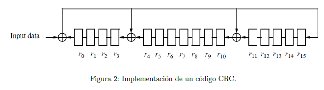
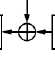
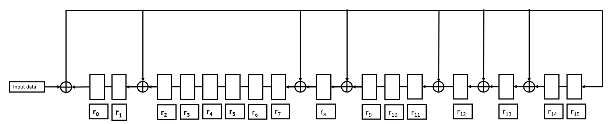

# Master Universitario de Ingeniería en Telecomunicaciones.

# 81.618 Codificaciones y modulaciones avanzadas - PEC1.

# José Enrique Rodríguez González.

## Presentación.

Esta PEC evalúa la primera parte de la asignatura Codificación de Fuente y Canal correspondiente al trabajo realizado en los módulos 1, 2 y 3. Está estructurada en diferentes partes y cada una tiene por objetivo evaluar los conocimientos adquiridos en uno del módulos a pesar de que encontraréis algunas cuestiones generales dado que uno de los objetivos de la PEC es que sinteticéis los conocimientos de los tres módulos.

---

## Competencias.

- Capacidad para construir, explotar y gestionar las redes, servicios, procesos y aplicaciones de telecomunicaciones, entendidas estas como sistemas de captación, transporte,  representación, procesamiento, almacenamiento, gestión y presentación de información multimedia, desde el punto de vista de los sistemas de transmisión.

- Capacidad para analizar, codificar, procesar y transmitir información multimedia empleando técnicas de procesado analógico y digital de señal.

---

## Objetivos.

- Evaluar la capacidad de diseñar un codificador de fuente PCM, un codificador diferencial, un codificador de Huffman, y entender el funcionamiento de un codificador con pérdidas (JPEG).

- Evaluar los conocimientos sobre codificadores de canal basados en códigos de bloque y códigos convolucionales.

- Evaluar la capacidad de resolver problemas sencillos de codificación y descodificación de secuencias incluyendo algunos códigos de canal y fuente presentados en los módulos 1, 2 y 3 de la asignatura
- Potenciar que el estudiante integre/sintetice mediante esta PEC (y a partir de un caso simplificado) los bloques de codificación de fuente y codificador de canal estudiados de forma aislada.

---

## Descripción de la PEC.

La PEC es extensa puesto que evalúa casi la mitad de la asignatura. Sin embargo está diseñada para que la podáis ir resolviendo a medida que vais finalizando el estudio de cada uno de los módulos. Así mismo, la mayoría de los ejercicios están planteados de forma que errores en apartados anteriores o apartados no resueltos, no condicionen que no podáis resolver satisfactoriamente el resto de la PEC. Dada su extensión, disponéis de cuatro semanas para resolverla. Se recomienda no dejar todo el trabajo para el final.

---

## Recursos.

**Recursos Básicos**

- Guías de estudio: GES1, GES2 i GES3.

- Materiales didácticos: Módulo 1, Módulo 2 y Módulo 3.

---

## Recursos Complementarios.

- Bibliografía básica y complementaria referenciada en los materiales didácticos

---

## Criterios de valoración.

Las respuestas tienen que estar debidamente justificadas y **sólo se valorarán las respuestas que se hayan justificado correctamente**.

La resolución de la cuarta parte, correspondiente a un ejercicio práctico, es opcional. El objetivo es doble, que podáis profundizar en un ejemplo práctico de compresión con pérdidas y a la vez aprendáis alguna noción sobre cómo funciona este tipo de compresión. Los alumnos que realicen la parte práctica se evaluará y se tendrá en cuenta favorablemente al final de curso para redondear la nota final del EC (siempre al alza). No se evaluará la práctica si os limitáis a adjuntar capturas de pantalla sin comentarios o con comentarios muy escuetos que no demuestren que habéis trabajado y entendido los resultados.

---

## Formato y fecha de entrega.

Se tiene que entregar la PEC **"en el apartado de registro de evaluación continua"** de vuestra aula.

Preferiblemente entregad el documento en PDF y comprobad que todas las ecuaciones se ven correctamente. Es posible incluir imágenes escaneadas de documentos elaborados a mano. En este caso, intentad cuidar al máximo la letra y la organización del documento. Si se desea se puede entregar en PDF y en formato Office. Se recomienda no realizar la entrega sólo en formato Word puesto que no siempre las fórmulas se mantienen en todas las versiones.

**Las páginas tienen que estar numeradas y vuestro nombre y apellidos también tiene que aparecer en la parte superior de cada una de las páginas del documento.**

---

## Índice

- [Enunciado](#enunciado)
- [Parte 1. Codificación de Fuente.](#parte-1-codificación-de-fuente)
- [Ejercicio 1.1.](#ejercicio-11)
- [Pregunta 1.1.1.](#pregunta-111)
- [Respuesta a la pregunta 1.1.1.](#respuesta-a-la-pregunta-111)
- [Pregunta 1.1.2.](#pregunta-112)
- [Respuesta a la pregunta 1.1.2.](#respuesta-a-la-pregunta-112)
- [Ejercicio 1.2.](#ejercicio-12)
- [Pregunta 1.2.1.](#pregunta-121)
- [Respuesta a la pregunta 1.2.1.](#respuesta-a-la-pregunta-121)
- [Pregunta 1.2.2.](#pregunta-122)
- [Respuesta a la pregunta 1.2.2.](#respuesta-a-la-pregunta-122)
- [Pregunta 1.2.3.](#pregunta-123)
- [Respuesta a la pregunta 1.2.3.](#respuesta-a-la-pregunta-123)
- [Pregunta 1.2.4.](#pregunta-124)
- [Respuesta a la pregunta 1.2.4.](#respuesta-a-la-pregunta-124)
- [Ejercicio 1.3.](#ejercicio-13)
- [Pregunta 1.3.1.](#pregunta-131)
- [Respuesta a la pregunta 1.3.1.](#respuesta-a-la-pregunta-131)
- [Pregunta 1.3.2.](#pregunta-132)
- [Respuesta a la pregunta 1.3.2.](#respuesta-a-la-pregunta-132)
- [Pregunta 1.3.3.](#pregunta-133)
- [Respuesta a la pregunta 1.3.3.](#respuesta-a-la-pregunta-133)
- [Pregunta 1.3.4.](#pregunta-134)
- [Respuesta a la pregunta 1.3.4.](#respuesta-a-la-pregunta-134)
- [Pregunta 1.3.5.](#pregunta-135)
- [Respuesta a la pregunta 1.3.5.](#respuesta-a-la-pregunta-135)
- [Pregunta 1.3.6.](#pregunta-136)
- [Respuesta a la pregunta 1.3.6.](#respuesta-a-la-pregunta-136)
- [Parte 2. Codificación de canal. Códigos de bloque](#parte-2-codificación-de-canal-códigos-de-bloque)
- [Pregunta 2.1.](#pregunta-21)
- [Respuesta a la pregunta 2.1.](#respuesta-a-la-pregunta-21)
- [Pregunta 2.2.](#pregunta-22)
- [Respuesta a la pregunta 2.2.](#respuesta-a-la-pregunta-22)
- [Pregunta 2.3.](#pregunta-23)
- [Respuesta a la pregunta 2.3.](#respuesta-a-la-pregunta-23)
- [Información Adicional](#información-adicional)
- [Pregunta 2.5.](#pregunta-25)
- [Respuesta a la pregunta 2.5.](#respuesta-a-la-pregunta-25)
- [Pregunta 2.6.](#pregunta-26)
- [Respuesta a la pregunta 2.6.](#respuesta-a-la-pregunta-26)
- [Pregunta 2.7.](#pregunta-27)
- [Respuesta a la pregunta 2.7.](#respuesta-a-la-pregunta-27)
- [Pregunta 2.8.](#pregunta-28)
- [Respuesta a la pregunta 2.8.](#respuesta-a-la-pregunta-28)
- [Pregunta 2.9.](#pregunta-29)
- [Respuesta a la pregunta 2.9.](#respuesta-a-la-pregunta-29)

-

---

## Enunciado.

**Introducción**

Como se describe en la introducción del módulo 1, el envío o almacenamiento de información resulta eficiente en la medida de que somos capaces de compactar los datos de información. Esta capacidad de compresión tenemos que poder desarrollarla sobre los datos de cualquier fuente de información (voz, imágenes y datos) que se transmite de forma habitual a través de las redes de comunicaciones o se almacena para su posterior recuperación. Del mismo modo, como se plantea en los módulos 2 y 3, los datos habrá que protegerlos frente a los errores que inevitablemente se producen en todo proceso de transmisión o lectura/escritura (almacenamiento y recuperación de la información). En esta PEC trabajaremos todo este proceso. En la primera parte de la PAC trabajaremos la codificación de la señal obtenida de una fuente. En la segunda parte de la PAC se analizará un esquema de codificación de bloque. La tercera parte de la PAC propondrá el estudio de esquemas FEC de corrección de errores basados en un código convolucional. Finalmente, la última parte de la PAC propondrá una práctica (de trabajo opcional) que se basará en la compresión de datos (imágenes) con pérdidas.

[Volver al Índice](#índice)

---

## Parte 1. Codificación de Fuente.

En esta primera parte estudiaremos la codificación de la información extraída a partir de dos sensores ambientales, uno de temperatura y otro de humedad ubicados en una habitación que se desea monitorear. Asumiremos que el rango de temperaturas a sensar está comprendida entre una $T_{min}=-2ºC$ y una $T_{max}=30ºC$. Respecto a la humedad no la sensaremos con demasiada precisión sólo nos interesará saber si ésta es muy baja $(H < 25 %)$, baja $(H ∈ [25 %, 50 %])$, alta $(H ∈ [50 %, 75 %])$ o muy alta $(H > 75 %)$. Para terminar de especificar el sensado de las fuentes hay que saber que se decide tomar una muestra de los sensores cada minuto (60 muestras por hora).

[Volver al Índice](#índice)

---

# Ejercicio 1.1.

Empezaremos realizando algunos cálculos sobre el sensado de la temperatura (olvidaremos de momento el sensado de la humedad). Asumiremos que se utilizan tres bits para sensar la temperatura,
de forma que $T = {0\text{ ◦C}, 4 \text{ ◦C}, 8 \text{ ◦C}, 12 \text{ ◦C}, 16 \text{ ◦C}, 20 \text{ ◦C}, 24\text{ ◦C}, 28\text{ ◦C}}$ serán las 8 posibles temperaturas
cuantificadas. A partir de la información de sensado descrita en el párrafo anterior responded a las
siguientes cuestiones:

[Volver al Índice](#índice)

---

## Pregunta 1.1.1.

- Si sólo se sensa la temperatura, indicad la tasa de bits en bits por segundo. (Nota: Dada la
baja velocidad de muestreo obtendréis un valor muy bajo).

[Volver al Índice](#índice)

---

## Respuesta a la pregunta 1.1.1.

Para calcular la tasa de bits en bits por segundo (bps) necesitamos saber cuántos bits se generan en un período de tiempo y cómo se relaciona ese período con un segundo.

Según la información proporcionada, la temperatura se muestrea una vez por minuto y se utiliza un sistema de codificación que utiliza 3 bits para representar uno de los 8 posibles valores de temperatura. Esto significa que cada muestra de temperatura genera 3 bits de información.

Dado que hay 60 segundos en un minuto y se toma una muestra por minuto, la tasa de bits sería de:

$\frac{3 \text{ bits por muestra}}{60 \text{ segundos}} = 0,05 \text{ bits por segundo (bps)}$

[Volver al Índice](#índice)

---

## Pregunta 1.1.2.

¿Cuál será la secuencia de bits obtenida si la secuencia de temperaturas es $T^a(t)=\{12 ; 13; 15; 16; 14,5; 12,5\}$.

[Volver al Índice](#índice)

---

## Respuesta a la pregunta 1.1.2.

Para convertir la secuencia de temperaturas $T^a(t)=\{12 ; 13; 15; 16; 14,5; 12,5\}$ a una secuencia de bits utilizando el sistema de codificación de temperatura dado $T = {0\text{ ◦C}, 4 \text{ ◦C}, 8 \text{ ◦C}, 12 \text{ ◦C}, 16 \text{ ◦C}, 20 \text{ ◦C}, 24\text{ ◦C}, 28\text{ ◦C}}$ con 3 bits, debemos cuantificar cada temperatura en el valor más cercano que puede ser representado por esos 3 bits.

La cuantificación y la codificación se haría de la siguiente manera:

- $12 \text{ ◦C}$ se cuantifica como $12 \text{ ◦C}$ (el valor exacto está disponible), que se codifica como $011$ en 3 bits.

- $12,5 \text{ ◦C}$ se cuantifica como $12 \text{ ◦C}$  (el valor más cercano disponible), que se codifica como $011$ en 3 bits.

- $13 \text{ ◦C}$ se cuantifica como $12 \text{ ◦C}$  (el valor más cercano disponible), que se codifica como $011$ en 3 bits.

- $14,5 \text{ ◦C}$ se cuantifica como $16 \text{ ◦C}$ (el valor más cercano disponible), que se codifica como $100$ en 3 bits.

- $15 \text{ ◦C}$ se cuantifica como $16 \text{ ◦C}$ (el valor más cercano disponible), que se codifica como $100$ en 3 bits.

- $16 \text{ ◦C}$ se cuantifica como $16 \text{ ◦C}$ (el valor exacto está disponible), que se codifica como $100$ en 3 bits.

Ahora mismo la secuencia esta ordenada por temperaturas, pero no por la secuencia, por lo que hay que ordenar la secuencia según $T^a(t)$, que en nuestro caso será:

$011;011;100;100;100;011$

[Volver al Índice](#índice)

---

# Ejercicio 1.2.

Teniendo en cuenta que los diferentes valores de temperatura son equiprobables, y que la temperatura de la sala en un minuto no varía más de 2ºC (arriba o abajo).

[Volver al Índice](#índice)

---

## Pregunta 1.2.1.

Calculad la entropía de la fuente.

[Volver al Índice](#índice)

---

## Respuesta a la pregunta 1.2.1.

La entropía de una fuente es una medida de la incertidumbre o la cantidad promedio de información por cada símbolo que se produce por la fuente. Para un conjunto de posibles eventos (en este caso, las temperaturas), la entropía $H$ se calcula utilizando la fórmula de Shannon:

$H = - \sum_{i=1}^{n} p(x_i) \log_2 p(x_i)$

donde $p(x_i)$ es la probabilidad del evento $x_i$ y $n$ es el número de posibles eventos.

Si todas las temperaturas son equiprobables, cada temperatura tiene una probabilidad de $\frac{1}{8}$. Por lo tanto, la entropía se calcula como:

$H = - \sum_{i=1}^{8} \left(\frac{1}{8}\right) \log_2 \left(\frac{1}{8}\right)$

$H = - 8 \times \left(\frac{1}{8}\right) \times \log_2 \left(\frac{1}{8}\right)$

$H = - \log_2 \left(\frac{1}{8}\right)$

Dado que $\log_2 (1/8)=\log_2 (2^{-3})$, y por las propiedades de los logaritmos $\log_b (a^c) = c \log_b (a)$, tenemos:

$H = 3 \times \log_2 (2)$

$H = 3$

La entropía de la fuente es de 3 bits por símbolo, lo que significa que en promedio cada muestra de temperatura lleva 3 bits de información.

[Volver al Índice](#índice)

---

## Pregunta 1.2.2.

Justificad por qué un codificador diferencial sería más adecuado que un codificador entrópico para comprimir la información sin pérdidas.

[Volver al Índice](#índice)

---

## Respuesta a la pregunta 1.2.2.

Un codificador diferencial es a menudo más adecuado que un codificador entrópico para comprimir datos que tienen una correlación temporal, especialmente cuando los cambios entre los valores sucesivos son pequeños en comparación con el rango completo de posibles valores. Esto se debe a varias razones:

1. **Reducción de la Varianza.**

En muchos procesos físicos, incluyendo la medición de la temperatura en una habitación, los valores sucesivos no varían drásticamente en periodos cortos de tiempo. Al codificar las diferencias entre las mediciones consecutivas en lugar de los valores absolutos, es probable que las diferencias sean menores que los valores absolutos, y por lo tanto se puedan representar con menos bits.

2. **Mejor Compresión.**

Debido a que las diferencias entre las muestras consecutivas son pequeñas, un codificador diferencial puede asignar códigos más cortos a las diferencias más frecuentes y pequeñas, lo que resulta en una tasa de compresión más alta.

3. **Adaptabilidad.**

Los codificadores diferenciales son buenos para adaptarse a los cambios lentos en los niveles de señal, lo que puede resultar en una mejor compresión sin pérdida a lo largo del tiempo.

4. **Eficiencia en la Codificación Entropía.**

Un codificador entrópico como el de Huffman o aritmético funcionará mejor cuando hay una gran diferencia en las probabilidades de los símbolos. Sin embargo, si cada temperatura es equiprobable y las diferencias entre valores consecutivos son pequeñas, el codificador entrópico no proporcionará mucha compresión sobre los datos ya que cada diferencia tiene una alta probabilidad de ocurrencia y, por lo tanto, se asignaría a códigos de longitud similar.

5. **Simplicidad en el Decodificador.**

Para decodificar un flujo de datos comprimido con codificación diferencial, el decodificador simplemente suma las diferencias sucesivas al valor inicial para recuperar los valores originales. Esto es más directo que el decodificar una estructura de datos entrópica, que puede ser más compleja.

6. **Robustez contra Errores.**

En algunos casos, un error en un codificador entrópico puede propagarse y causar la pérdida de una gran cantidad de datos subsiguientes. En cambio, en un codificador diferencial, un error solo afecta dos valores: el valor en el que se produjo el error y el siguiente valor calculado.

***Conclusión***

Para la tarea de compresión sin pérdidas de datos de temperatura de una habitación, donde las fluctuaciones son limitadas, un codificador diferencial es particularmente apropiado. Hay que aprovechar la naturaleza de las variaciones de temperatura, que suelen ser pequeñas en intervalos cortos, para proporcionar una compresión eficiente. Al contrastarlo con un codificador entrópico, el cual no ofrece ventajas significativas en un contexto de probabilidades uniformes y diferencias mínimas, se destaca la eficiencia de la codificación diferencial en términos de simplicidad, robustez y capacidad de compresión. Por lo tanto, para el caso específico de la monitorización de la temperatura ambiente en una habitación, la codificación diferencial no solo es más adecuada, sino que también asegura la integridad de los datos a través de una recuperación fiable en el proceso de decodificación.

[Volver al Índice](#índice)

---

## Pregunta 1.2.3.

Si haciendo uso del codificador diferencial mantenemos la codificación de la temperatura con tres bits no habrá compresión de la información (la tasa de bits sería la misma que la calculada en la cuestión 1.1.2). Indicad en este caso cuál seria el beneficio de utilizar el codificador diferencial.

[Volver al Índice](#índice)

---

## Respuesta a la pregunta 1.2.3.

Aunque mantener la codificación de tres bits para la temperatura con un codificador diferencial no reduciría la tasa de bits en sí misma, todavía hay beneficios significativos al utilizar este enfoque:

1. **Redundancia Temporal.**

La ventaja principal del codificador diferencial es que explota la redundancia temporal entre muestras consecutivas. Si las temperaturas no varían drásticamente en periodos cortos, las diferencias entre muestras consecutivas serán pequeñas. Aunque estas diferencias aún se codifiquen con tres bits, la distribución de los valores codificados será tal que valores menores (cercanos a cero) serán más comunes, lo que puede ser aprovechado por un segundo nivel de compresión, como un codificador entrópico, si se decide implementarlo posteriormente.

2. **Simplificación de la Representación.**

Al utilizar un codificador diferencial, la mayoría de las diferencias registradas serían de valor bajo y posiblemente se concentren alrededor de cero, lo que puede simplificar el seguimiento y análisis de los datos, ya que se estaría observando las variaciones más que los valores absolutos, lo que es a menudo más relevante para detectar tendencias o eventos.

3. **Reducción de Errores en la Transmisión.**

En la transmisión de datos, especialmente en canales ruidosos, la codificación diferencial puede reducir la cantidad de información que se pierde o se corrompe debido a errores. Un error en la transmisión de una diferencia afectaría solo dos valores: el valor actual y el siguiente valor reconstruido. En un sistema de codificación absoluto, un error puede tener un impacto mucho mayor.

4. **Eficacia en Escenarios de Cambios Menores.**

En situaciones donde la temperatura de una sala cambia poco, la mayoría de las diferencias serán ceros (cuando la temperatura no cambia en absoluto) o estarán cerca de cero. Esto significa que a pesar de usar tres bits, el espectro real de valores utilizados es pequeño y predecible, lo que puede ser útil para optimizaciones adicionales en la cadena de procesamiento de datos.

***Conclusión***

Por tanto, el beneficio principal de utilizar un codificador diferencial en este contexto no es una reducción en la tasa de bits, sino una representación más eficiente de la información que puede llevar a una mejor compresión en etapas posteriores, una simplificación en el análisis de datos y una mejora en la robustez frente a errores de transmisión.

[Volver al Índice](#índice)

---

## Pregunta 1.2.4.

Si haciendo uso del codificador diferencial queremos mantener el mismo error de cuantificación que el que se tiene sin el codificador diferencial (calculado a la cuestión 1.1.1) indicad cuál seria el factor de compresión obtenido haciendo uso del codificador diferencial.

[Volver al Índice](#índice)

---

## Respuesta a la pregunta 1.2.4.

Para calcular el factor de compresión al usar un codificador diferencial, necesitamos comparar la tasa de bits original con la nueva tasa de bits después de aplicar la codificación diferencial.

Originalmente, sin compresión, la tasa de bits era de 0,05 bits por segundo (bps) porque cada muestra se codifica con 3 bits y se toma una muestra por minuto:

$\text{Tasa de bits original} = 3 \text{bits/muestra} \times \frac{1 \text{muestra}}{60 \text{segundos}} = 0,05 \text{bps}$

Con un codificador diferencial, asumiendo que queremos mantener el mismo error de cuantificación y que las diferencias entre las muestras sucesivas de temperatura se pueden codificar con menos bits debido a que la temperatura cambia poco de un minuto a otro, la tasa de bits podría ser menor.

Sin embargo, la tasa de bits se mantendría igual si seguimos usando 3 bits para codificar la diferencia de temperatura, porque estamos suponiendo que no hay compresión de datos (aún usamos el mismo número de bits).

Entonces, si estamos usando el mismo número de bits para la codificación diferencial como para la codificación sin compresión, no habría una reducción en la tasa de bits, y por lo tanto, el factor de compresión sería 1 (sin compresión):

$\text{Factor de compresión} = \frac{\text{Tasa de bits original}}{\text{Tasa de bits con codificador diferencial}}$

Dado que la tasa de bits se mantiene en 0,05 bps en ambos casos:

$\text{Factor de compresión} = \frac{0,05 \text{bps}}{0,05 \text{bps}} = 1$

Esto significa que no hay compresión (factor de compresión = 1) si seguimos usando tres bits para representar las diferencias de temperatura con el codificador diferencial.

Para obtener un factor de compresión usando codificación diferencial, tendríamos que poder representar las diferencias de temperatura con menos de tres bits de promedio. Esto podría lograrse si las diferencias entre temperaturas consecutivas son realmente pequeñas y, por lo tanto, requieren menos bits para su representación exacta o aproximada. El cálculo del factor de compresión real necesitaría esta información detallada sobre la distribución y tamaño de las diferencias de temperatura.

[Volver al Índice](#índice)

---

## Ejercicio 1.3.

A continuación planteamos el sensado de las dos variables, temperatura y humedad. Sabemos que los valores de la temperatura son equiprobables y cuando para una temperatura (según la figura 1.) hay más de un valor de humedad posible, entonces estos valores de humedad son equiprobables. Como puede verse, temperatura y humedad no son independiente sino que una humedad muy alta sólo se produce cuando la temperatura es alta y una humedad muy baja sólo la encontramos para temperaturas bajas. La siguiente figura indica la relación entre la temperatura y la humedad:

[Volver al Índice](#índice)

---

## Pregunta 1.3.1.

Si ignoramos la información de la figura 1 y codificamos de manera independiente temperatura y humedad, indicad la tasa de bits en bits por segundo.

[Volver al Índice](#índice)

---

## Respuesta a la pregunta 1.3.1.

Si ignoramos la información de la figura 1 y codificamos temperatura y humedad de manera independiente, necesitaríamos calcular la tasa de bits para cada variable y luego sumarlas para obtener la tasa de bits total.

Para la temperatura, ya hemos calculado previamente que la tasa de bits es de 0,05 bps, ya que se toma una muestra cada minuto y se usa una codificación de 3 bits por muestra.

Para la humedad, necesitamos definir cuántos bits utilizar para codificarla. Dado que hay cuatro rangos posibles para la humedad según la información proporcionada, podemos usar dos bits para codificar estos cuatro estados (00, 01, 10, 11).

Al igual que con la temperatura, se toma una muestra por minuto, así que la tasa para la humedad sería:

Entonces, sumando la codificación de ambos:

- Temperatura: $3 \text{ bits } / \text{ muestra}$.

- Humedad: $2 \text{ bits } / \text{ muestra}$.

Tomando una muestra de cada sensor por minuto, la tasa total de bits sería la suma de ambas tasas, cada una dividida por 60 segundos para obtener la tasa en bits por segundo (bps).

- $\text{Tasa de bits para temperatura}  = 3 \text{ bits / muestra } \times \frac{1\text{ muestra}}{60\text{ segundos}}$
- $\text{Tasa de bits para humedad} = 2\text{ bits / muestra} \times \frac{1 \text{ muestra}}{60\text{ segundos}}$
- $\text{Tasa de bits total} = \text{(Tasa de bits para temperatura) + (Tasa de bits para humedad)}$

- Tasa de bits para temperatura: $3 \text{ bits/muestra} \times \frac{1 \text{ muestra}}{60 \text{ segundos}} = 0.05 \text{ bps}$
- Tasa de bits para humedad: $2 \text{ bits/muestra} \times \frac{1 \text{ muestra}}{60 \text{ segundos}} = 0.0333\overline{3} \text{ bps}$
- Tasa de bits total: $0.05 \text{ bps} + 0.0333\overline{3} \text{ bps} = 0.0833\overline{3} \text{ bps}$

[Volver al Índice](#índice)

---

## Pregunta 1.3.2.

Haciendo uso de la información de la figura 1 justificad por qué un codificador entrópico permitiría obtener un flujo de información inferior al obtenido en el apartado anterior.

[Volver al Índice](#índice)

---

## Respuesta a la pregunta 1.3.2.

Un codificador entrópico, como Huffman o aritmético, permite obtener un flujo de información inferior al codificar de manera independiente porque puede explotar las dependencias estadísticas y las probabilidades no uniformes entre los símbolos para asignar códigos más cortos a los eventos más probables y códigos más largos a los menos probables.

La información proporcionada en la figura 1 establece una dependencia entre la temperatura y la humedad:

-Una humedad muy baja (< 25%) solo se da si la temperatura es < 8ºC.

- Una humedad baja (25-50%) se da si la temperatura está entre 6ºC y 18ºC.

- Una humedad alta (50-75%) se da si la temperatura está entre 10ºC y 18ºC.

- Una humedad muy alta (> 75%) solo se da si la temperatura es > 14ºC.

Esta dependencia significa que no todas las combinaciones de temperatura y humedad son igualmente probables. Por ejemplo, no encontraremos una humedad muy alta si la temperatura es baja (<14ºC). Esta relación reduce el número de combinaciones posibles que necesitamos considerar al codificar la información.

Al utilizar un codificador entrópico que tiene en cuenta estas dependencias, asignamos códigos más cortos a las combinaciones de temperatura y humedad que ocurren con más frecuencia y códigos más largos (o incluso ninguno) a las combinaciones que son imposibles o menos probables, reduciendo así la cantidad promedio de bits necesarios por muestra.

Esto no es posible cuando se codifica la temperatura y la humedad de manera independiente, ya que se asume que todas las combinaciones son igualmente probables, y cada variable se codifica sin tener en cuenta la otra, lo que lleva a una tasa de bits mayor porque no se están utilizando las deficiencias de la distribución conjunta de ambas variables.

[Volver al Índice](#índice)

---

## Pregunta 1.3.3.

Si, como en los apartados anteriores, se utilizan tres bits por sensar la temperatura, indicad cuál seria la entropía de la fuente haciendo uso de la información de la figura 1.

[Volver al Índice](#índice)

---

## Respuesta a la pregunta 1.3.3.

Para calcular la entropía de la fuente teniendo en cuenta la dependencia entre la temperatura y la humedad proporcionada por la información de la figura 1, primero debemos identificar todas las combinaciones posibles de temperatura y humedad y luego calcular la probabilidad de cada combinación. La entropía se calculará luego como la suma de las probabilidades de cada combinación multiplicada por el logaritmo (base 2) de su probabilidad inversa.

Considerando las temperaturas posibles sensadas en incrementos de 4°C, desde 0°C hasta 28°C, y las restricciones de humedad, las combinaciones válidas y sus probabilidades serían:

Temperatura < 8ºC: humedad < 25%.
Temperatura entre 8ºC (incluido) y 14ºC: humedad puede ser entre 25% y 50%.
Temperatura entre 14ºC (incluido) y 18ºC: humedad puede ser entre 25% y > 75%.
Temperatura > 18ºC: humedad puede ser entre 50% y > 75%.
Suponiendo que todas las temperaturas son equiprobables, tenemos 8 posibles temperaturas sensadas. La humedad también tiene restricciones basadas en la temperatura.

Primero debemos calcular la probabilidad de cada evento (combinación de temperatura y humedad). Para hacer esto de manera precisa, necesitaríamos saber la distribución de probabilidad de la humedad dentro de los rangos de temperatura dados. Sin esa información y asumiendo equiprobabilidad dentro de los rangos dados, tendríamos que hacer suposiciones. Por ejemplo, podríamos suponer que dentro de un rango de temperatura, todas las humedades posibles son igualmente probables.

Vamos a calcular la entropía bajo la suposición de que todas las temperaturas y humedades posibles son equiprobables dentro de los rangos dados por las restricciones. No podemos dar un número exacto sin más información, pero puedo mostrarte cómo se haría el cálculo:

1. Asigna probabilidades a cada combinación de temperatura y humedad según las restricciones.
2. Calcula la entropía $H$ usando la fórmula de la entropía:
$$
H(X) = -\sum{p(x) \log_2{p(x)}}
$$
donde $p(x)$ es la probabilidad de la combinación $x$.

Podríamos establecer la entropía de la temperatura por separado (ya que la humedad depende de la temperatura pero no al revés), lo cual sería más simple. Con 8 temperaturas equiprobables y 3 bits por temperatura, la entropía máxima de la temperatura sería simplemente los 3 bits, ya que la fuente es máximamente aleatoria y cada estado es igualmente probable. Sin embargo, al considerar la información adicional sobre la humedad, la entropía conjunta probablemente sería menor porque hay menos incertidumbre cuando se consideran las restricciones.

Para obtener la entropía exacta, tendríamos que hacer los cálculos con las probabilidades específicas de cada combinación de temperatura y humedad, que requeriría más información de la figura 1 o suposiciones adicionales.

[Volver al Índice](#índice)

---

## Pregunta 1.3.4.

Diseñad el código de Huffman que permite comprimir la fuente (respecto el resultado obtenido en el apartado 1.3.1).

[Volver al Índice](#índice)

---

## Respuesta a la pregunta 1.3.4.

Para diseñar el código de Huffman para una fuente de información, debemos seguir una serie de pasos. Los pasos para construir un código de Huffman, dados los datos del apartado 1.3.1, son los siguientes:

1. Determinar la probabilidad de cada símbolo que se va a codificar.

2. Construir un árbol de Huffman, empezando por los símbolos menos probables y combinándolos en nodos que suman sus probabilidades hasta llegar a la raíz del árbol, que tiene una probabilidad total de 1.
3. Asignar un 0 y un 1 a cada bifurcación del árbol, de manera que ningún código sea prefijo de otro.
4. Leer los códigos desde la raíz hasta las hojas para obtener el código de Huffman para cada símbolo.

Para la temperatura, tenemos 8 posibles temperaturas equiprobables, y para la humedad, tenemos 4 rangos de humedad equiprobables. Sin información adicional sobre la probabilidad exacta de cada símbolo de temperatura o humedad, asumiremos que son uniformes. Entonces, cada temperatura tiene una probabilidad de 1/8 y cada rango de humedad tiene una probabilidad de 1/4.

Dado que se codifican de forma independiente, podríamos hacer dos árboles de Huffman separados: uno para la temperatura y otro para la humedad. Sin embargo, para el cálculo real, necesitaríamos la frecuencia o la probabilidad de cada símbolo de la fuente. Como no se ha proporcionado, usaré probabilidades equiprobables para ilustrar cómo se haría:

**Árbol de Huffman para la temperatura** (con probabilidad 1/8 para cada uno de los 8 símbolos):

1. Agrupamos los símbolos en pares hasta que solo quede un nodo.
2. Asignamos códigos 0 y 1 alternativamente a cada agrupamiento.

**Árbol de Huffman para la humedad**(con probabilidad 1/4 para cada uno de los 4 rangos):

1. Similarmente, agrupamos los símbolos en pares.
2. Asignamos códigos 0 y 1 alternativamente a cada agrupamiento.

A continuación escribiremos la secuencia de probabilidades y a elaborar un código válido.

**Temperatura:**

Tenemos 8 temperaturas diferentes, cada una con una probabilidad de 1/8.

**Paso 1: Listar las probabilidades:**

- $T_1 = 0°C$, probabilidad: $P(T_1) = \frac{1}{8}$
- $T_2 = 4°C$, probabilidad: $P(T_2) = \frac{1}{8}$
- $T_3 = 8°C$, probabilidad: $P(T_3) = \frac{1}{8}$
- $T_4 = 12°C$, probabilidad: $P(T_4) = \frac{1}{8}$
- $T_5 = 16°C$, probabilidad: $P(T_5) = \frac{1}{8}$
- $T_6 = 20°C$, probabilidad: $P(T_6) = \frac{1}{8}$
- $T_7 = 24°C$, probabilidad: $P(T_7) = \frac{1}{8}$
- $T_8 = 28°C$, probabilidad: $P(T_8) = \frac{1}{8}$

**Paso 2: Construir el árbol de Huffman.**

Dado que todas las temperaturas tienen la misma probabilidad, podemos asignar códigos binarios de manera uniforme. No hay una estructura de árbol única en este caso, ya que todas las combinaciones tendrán la misma longitud de código.

***Humedad:***

Tenemos 4 rangos de humedad, cada uno con una probabilidad de 1/4.

**Paso 1: Listar las probabilidades:**

- $H_1$: H < 25%, probabilidad: $P(H_1) = \frac{1}{4}$
- $H_2$: 25% ≤ H < 50%, probabilidad: $P(H_2) = \frac{1}{4}$
- $H_3$: 50% ≤ H < 75%, probabilidad: $P(H_3) = \frac{1}{4}$
- $H_4$: H ≥ 75%, probabilidad: $P(H_4) = \frac{1}{4}$

**Paso 2: Construir el árbol de Huffman.**

Al igual que con la temperatura, debido a la igualdad de las probabilidades, cualquier asignación de códigos binarios de 2 bits será eficiente y no hay una estructura de árbol única para este caso.

***CONCLUSION***

En resumen, para nuestro caso particular donde la temperatura y la humedad tienen distribuciones de probabilidad uniformes, la utilización de un código de Huffman no ofrecería una eficiencia superior en comparación con una codificación binaria de longitud fija. Esto se debe a que el código de Huffman es más eficiente cuando existen diferencias significativas en las probabilidades de ocurrencia de los símbolos. Dado que cada símbolo en nuestro escenario tiene la misma probabilidad, cada uno se podría asignar de manera óptima a un código binario de longitud fija, siendo 3 bits para las temperaturas y 2 bits para los rangos de humedad. Por lo tanto, en ausencia de variabilidad en las probabilidades, un código de Huffman no reduce la longitud promedio del código y no aporta beneficios en términos de compresión de datos.

[Volver al Índice](#índice)

---

## Pregunta 1.3.5.

Determinad el flujo de información medio obtenido haciendo uso de este codificador.

[Volver al Índice](#índice)

---

## Respuesta a la pregunta 1.3.5.

Recordemos que las tasas de bits calculadas anteriormente para la temperatura y la humedad, sin considerar el codificador de Huffman, eran de 0.05 bps y 0.0333... bps, respectivamente, debido a que se toma una muestra por minuto de cada sensor y que utilizamos 3 bits para codificar la temperatura y 2 bits para codificar la humedad.

La tasa de bits total, que es la suma de las tasas de bits para la temperatura y la humedad, fue de 0.0833... bps.

Así, el flujo de información medio usando un codificador de Huffman (que en este caso es igual a la codificación binaria de longitud fija) sería de 0.0833... bps.

[Volver al Índice](#índice)

---

## Pregunta 1.3.6.

¿Cuál será el factor de compresión obtenido?

[Volver al Índice](#índice)

---

## Respuesta a la pregunta 1.3.6.

El factor de compresión se obtiene comparando el tamaño original de los datos con el tamaño después de la compresión. Sin embargo, como se ha mencionado antes, con una distribución uniforme de los símbolos y la asignación de códigos de Huffman (que en este caso serían de longitud fija igual al caso sin compresión debido a la igualdad de probabilidades), no habrá ninguna compresión real. Esto significa que el factor de compresión sería 1, lo que indica que no hay reducción en el tamaño.

$
\text{Factor de compresión} = \frac{\text{ Tamaño sin compresión}}{\text{Tamaño con compresión}}
$

En este caso, al no haber una compresión efectiva con el código de Huffman debido a la igualdad en la distribución de probabilidad de los símbolos, el tamaño de los datos con compresión es igual al tamaño sin compresión.

$
\text{Factor de compresión} = \frac{\text{ Tamaño sin compresión}}{\text{Tamaño con compresión (igual a sin compresión)}}=\frac{1}{1}=1
$

Por lo tanto, el factor de compresión es 1. Esto significa que no hay ningún beneficio en términos de compresión al utilizar el código de Huffman en este escenario específico.

[Volver al Índice](#índice)

---

## Parte 2. Codificación de canal. Códigos de bloque

Con objeto de garantizar la integridad de los bytes transmitidos, en el curso se ha visto que estos se pueden proteger con un código de comprobación de redundancia cíclica (Cyclic Redundancy Check o CRC). Trabajaron en esta PEC dos posibles esquemas.

El primer código CRC del estándar corresponde al del esquema que se muestra a la siguiente figura:

[Volver al Índice](#índice)

---

## Pregunta 2.1.

¿Cuál es el polinomio generador asociado al esquema anterior?

[Volver al Índice](#índice)

---

## Respuesta a la pregunta 2.1.

El esquema mostrado en la figura representa un circuito de desplazamiento con retroalimentación, también conocido como registro de desplazamiento con retroalimentación lineal, que se utiliza para calcular el Cyclic Redundancy Check (CRC). Para determinar el polinomio generador a partir del esquema, debes seguir las conexiones que representan los términos del polinomio.

En el diagrama, las posiciones donde hay conexiones que se retroalimentan al registro de desplazamiento (denotadas por círculos con una "+", como se muestra en la siguiente imagen a continuación del presente párrafo, que representan la operación XOR) indican los términos del polinomio. Los índices $r_0 , r_1 , ..., r_{15}$ representan los bits de registro, y los bits que se retroalimentan son aquellos donde las líneas se cruzan con una puerta XOR antes de ingresar de nuevo al registro de desplazamiento.

> Puerta XOR

Si las XOR están ubicadas entre:

- La entrada de datos y $R_0$.
- $r_3$ y $r_4$
- $r_{10}$ y $r_{11}$

Por otro lado, considerando que el sistema llega hasta $r_{15}$, el polinomio generador puede ser determinado de la siguiente manera:

- El XOR entre el `input data` y $r_0$ indica que el bit más bajo indica que el bit más bajo $r_0$ (que correspondería al término $x^0$) está involucrado en la retroalimentación.

- El XOR entre $r_3$ y $r_4$ indica que 

- El XOR entre $r_3$ y $r_4$ indica que $r_3$ (correspondiente a $x^3$) está involucrado.

- El XOR entre $r_{10}$ y $r_{11}$ indica que $r_{10}$ (correspondiente a $x^{10}$) está involucrado.

- Además, debido a que el sistema llega hasta $r_{15}$, el término más alto en el polinomio es $x^{15}$, representando el bit más significativo.

Entonces, el polinomio generador $G(x)$ basado en el esquema proporcionado y tus aclaraciones es:

$G(x) = x^{15} + x^{10} + x^3 + 1$

Esto se deduce de la estructura de la retroalimentación que has descrito. En el polinomio, no se incluyen los índices para los bits $r_i$ que no tienen una conexión XOR, lo que significa que esos términos no aparecen en el polinomio.

[Volver al Índice](#índice)

---

## Pregunta 2.2.

¿Cuántos bytes de redundancia genera?

[Volver al Índice](#índice)

---

## Respuesta a la pregunta 2.2.

El polinomio generador que hemos determinado es:

$G(x) = x^{15} + x^{10} + x^3 + 1$

La potencia más alta en un polinomio generador de CRC indica el tamaño del CRC generado. En este caso, el término más alto es $x^{15}$, lo que significa que el CRC generado será de 16 bits de longitud (se empieza a contar desde 0).

Dado que 8 bits conforman un byte, un CRC de 16 bits equivaldrá a 2 bytes. Por lo tanto, este esquema de CRC genera 2 bytes de redundancia.

[Volver al Índice](#índice)

---

## Pregunta 2.3.

¿Podríamos decir cuál es la capacidad de detección que se consigue? En caso afirmativo indicadla.

[Volver al Índice](#índice)

---

## Respuesta a la pregunta 2.3.

La capacidad de detección de un código CRC depende del polinomio generador y su longitud. Un polinomio de CRC de n bits puede detectar:

1. Todos los errores de un solo bit (cualquier bit único que cambie de 0 a 1 o de 1 a 0).

2. Cualquier error de inversión de dos bits (dos bits que cambien de lugar entre sí).

3. Cualquier error impar de bits (un número impar de bits cambian de estado).

4. Cualquier error de ráfaga menor o igual a n bits (un error de ráfaga es una secuencia de bits adyacentes que cambian de estado, donde los bits que cambian están completamente contenidos en una secuencia de n bits).

En el caso del polinomio generador:

$G(x) = x^{15} + x^{10} + x^3 + 1$

El CRC resultante es de 16 bits. Por lo tanto, podemos decir que este CRC puede detectar:

- Todos los errores de un solo bit, ya que cualquier cambio en un solo bit resultará en un polinomio diferente al dividirse por el polinomio generador.

- Todos los errores de dos bits, porque la distancia mínima de Hamming para un polinomio de 16 bits es 3, lo que significa que puede detectar y distinguir patrones de error de dos bits.

- Cualquier error impar de bits, debido a la propiedad de detección de errores impares de los CRC basados en polinomios generadores con el término constante (el '+1' al final del polinomio asegura esto).

- Cualquier error de ráfaga que tenga una longitud de 16 bits o menos. Dado que el CRC es de 16 bits, cualquier patrón de error que afecte hasta 16 bits contiguos será detectado.

Además, la capacidad de detección disminuye a medida que la longitud de la ráfaga de error supera los 16 bits, pero incluso en esos casos, hay una alta probabilidad de detección, aunque no está garantizada al 100%. Es importante tener en cuenta que mientras más largo sea el CRC, mejor será su capacidad general de detección de errores, especialmente para errores de ráfaga más largos.

[Volver al Índice](#índice)

---

## Información adicional.

El segundo código CRC del estándar es un código de 16 bits asociado al polinomio generador $G = 202611 _{OCT}$ . A partir de la información que proporciona este polinomio se pide:

[Volver al Índice](#índice)

---

## Pregunta 2.5.

¿Cuál es la expresión del polinomio generador $g(p)$?

[Volver al Índice](#índice)

---

## Respuesta a la pregunta 2.5.

Para convertir el polinomio generador dado en notación octal $G = 202611 _{OCT}$ a su forma binaria y luego a su forma polinómica, seguimos estos pasos:

1. Convertir cada dígito octal a su equivalente binario de 3 bits.
2. Combinar los equivalentes binarios para formar el número completo en binario.
3. Escribir el polinomio $g(p)$ correspondiente a la forma binaria, donde cada bit representa un coeficiente del polinomio, comenzando con el bit menos significativo.

Convierte cada dígito octal a binario:

- $2 _{OCT} = 010 _{BIN}$

- $0 _{OCT} = 000 _{BIN}$

- $6 _{OCT} = 110 _{BIN}$

- $1 _{OCT} = 001 _{BIN}$

Combínalos para obtener la secuencia binaria completa:

- $202611 _{OCT}= 010000010110001001 _{BIN}$

Invertimos las posiciones porque la secuencia binaria es empieza por el lado derecho, el bit menos significativo:

- $1001101101000010 _{BIN}$

Ahora, escribimos el polinomio $g(p)$ usando la secuencia binaria, donde cada '1' representa un término en el polinomio y el índice del término corresponde a la posición del bit, comenzando desde el lado derecho con el exponente 0:

$g(p) = x^{15} + x^{13} + x^{12} + x^{11} + x^{8} + x^{7} + x^{1}$

Este es el polinomio generador expresado en forma polinómica a partir del número octal dado.

[Volver al Índice](#índice)

---

## Pregunta 2.6.

Dibujad el diagrama de bloques que permite codificar una secuencia de información.

[Volver al Índice](#índice)

---

## Respuesta a la pregunta 2.6.

[Volver al Índice](#índice)

---

## Pregunta 2.7.

Indicad cuál será el contenido del bloque de CRC si la trama de información es todo ceros excepto los últimos bits {0 0 0 . . . 0 0 1 1 1}, donde los puntos suspensivos indican que todos los bits intermedios son cero. Tened presente que la secuencia se empieza a codificar por la izquierda.

[Volver al Índice](#índice)

---

## Respuesta a la pregunta 2.7.

Para calcular el contenido del bloque de CRC para la trama de información dada, necesitamos seguir el proceso de división binaria que implementa el CRC, pero hay un atajo importante que podemos utilizar en este caso específico. Debido a que todos los bits de la trama de información son ceros hasta los últimos tres bits, la división por el polinomio generador solo afectará a esos últimos tres bits y los bits de CRC que les siguen directamente.

En otras palabras, como los primeros bits de la trama son ceros, no cambian el contenido del registro de desplazamiento hasta que llegamos a los últimos tres bits, donde la trama de información tiene tres unos consecutivos. Este es el único momento en que la trama de información realmente interactúa con el polinomio generador para cambiar los valores en el registro de desplazamiento.

Dado que la trama se empieza a codificar por la izquierda, estos últimos tres unos se procesarán al final, y el efecto de su procesamiento se reflejará en los bits más bajos del CRC. Por lo tanto, el contenido del bloque de CRC será simplemente el resultado de la división del polinomio asociado a los tres unos finales de la trama por el polinomio generador.

El polinomio asociado con la secuencia de bits {0 0 0 ... 0 0 1 1 1} es:

$x^2+x^1+x^0$

$0000000000000111$

[Volver al Índice](#índice)

---

## Pregunta 2.8.

Con la información disponible, y sin hacer más cálculos, ¿podemos argumentar cuál de los dos códigos es preferible utilizar? En caso afirmativo indicad cuál es mejor y en caso de que no se pueda afirmar, argumentad la respuesta.

[Volver al Índice](#índice)

---

## Respuesta a la pregunta 2.8.

- El primer código CRC corresponde al esquema proporcionado anteriormente, que usa un polinomio generador de grado 15. No hemos discutido la detección de errores específica o la capacidad correctora de este polinomio.

El segundo código CRC es un código de 16 bits asociado al polinomio generador $G=202611 _{OCT}$, que no ha sido completamente descrito en términos de su capacidad de detección o corrección de errores.

Basándonos en lo general de los códigos CRC:

**Longitud del código.**

Cuanto más largo sea el código CRC, en general, mayor será su capacidad para detectar errores. Un código de 16 bits puede detectar cualquier error de un solo bit, cualquier error de dos bits (dependiendo del polinomio), y es muy probable que detecte errores con más bits afectados o errores de ráfagas (burst errors).

**Polinomio generador.**

El polinomio generador determina el tipo de errores que el CRC puede detectar. Un buen polinomio generador puede detectar errores comunes que ocurren en el canal de comunicación. Sin más información sobre el polinomio asociado con el primer código CRC, es difícil comparar directamente su efectividad con la del segundo código CRC.

**Aplicación específica.**

Dependiendo del contexto de uso, diferentes códigos CRC pueden ser preferibles. Por ejemplo, en aplicaciones donde el tamaño del mensaje es muy grande, un CRC más largo puede ser más beneficioso. En aplicaciones donde la velocidad de transmisión es crítica y los mensajes son cortos, un CRC más corto puede ser más adecuado.

[Volver al Índice](#índice)

---

## Pregunta 2.9.

Se quiere diseñar un código de bloque más simple que los anteriores y se nos encarga la tarea de determinar si es possible diseñar un código con las siguientes características:

capacidad correctora de un bit, k = 16 i n = 20.

Determinad si es o no posible encontrar este código. En caso afirmativo indicad cómo se encontraría (no se pide que lo encontréis) y en caso de que no se pueda razonad el motivo.

[Volver al Índice](#índice)

---

## Respuesta a la pregunta 2.9.

Para diseñar un código de bloque con capacidad de corrección de un bit, necesitamos utilizar un código que tenga suficientes bits de redundancia para identificar no solo la presencia de un error, sino también su ubicación exacta en el bloque de datos.

La capacidad de un código de corregir errores se basa en la distancia de Hamming del código. La distancia de Hamming de un código corrector de errores es el número mínimo de posiciones en las que dos bloques de código de igual longitud difieren. Para que un código pueda corregir hasta $t$ errores, se requiere una distancia de Hamming de $2t+1$

Un código de bloque con las siguientes características:

- Capacidad correctora de un bit $(t=1)$.

- $k=16$ (longitud de la palabra de datos)

- $n=20$ (longitud total de la palabra del código, incluyendo datos y redundancia)

Tiene $n−k=20−16=4$ bits de redundancia.

Para determinar si es posible crear tal código, podemos usar el teorema de la capacidad de canal de Hamming, que establece que, para corregir $t$ errores en un código de bloque, se deben satisfacer la siguiente condición:

$2 \geq k + r + 1$

Donde $r$ es el número de bits de redundancia y $k$ es el número de bits de datos. En nuestro caso, queremos que:

$2^4 \geq 16+4+1$

$16 \geq 21$

Esta condición no se cumple porque 16 no es mayor o igual a 21. Por lo tanto, con 4 bits de redundancia, no podemos satisfacer las condiciones necesarias para tener un código con capacidad correctora de un solo bit para 16 bits de datos.

Para cumplir con el requisito de corrección de un bit con $k=16$, necesitaríamos al menos 5 bits de redundancia, lo que daría un código de longitud $n=k+r=16+5=21$.

Por lo tanto, no es posible diseñar un código con las características exactas dadas ($k=16$, $n=20$, capacidad correctora de un bit) usando los principios estándar de los códigos de corrección de errores de bloque. Se necesitarían más bits de redundancia para proporcionar la capacidad correctora de un bit para un bloque de datos de 16 bits.

[Volver al Índice](#índice)

---

## Parte 3. Codificación de canal.

Típicamente, las secuencias de datos transmitidas por el canal pueden protegerse utilizando un codificador
de canal. El diagrama de bloques de la siguiente figura podría corresponder a uno de ellos. Responded a las diferentes preguntas:

[Volver al Índice](#índice)

---

## Pregunta 3.1

¿Cuál es la tasa del código?

[Volver al Índice](#índice)

---

## Respuesta a la pregunta 3.1.

Vamos a llamar de derecha a izquierda los retardos de la siguiente manera $( \text{za, zb, zc, zd, ze ,zf})$, a los XOR los vamos a relacionar con sus outpouts $(\text{XORa, XORb})$

Por tanto, para el análisis, consideremos lo siguiente:

El "Input Data" ingresa al sistema y se dirige hacia tres destinos: directamente a los dos XOR (XORa y XORb) y al primer retardo (za).

Cada retardo (za, zb, zc, zd, ze, zf) representa un paso de tiempo y puede considerarse como una etapa en la que se puede manipular un bit de entrada.

Los bits procesados a través de los retardos y combinados en los XOR se utilizan para generar bits de redundancia para la corrección de errores.

Con estos puntos en mente, cada retardo que conecta directamente a un XOR (o a ambos) esencialmente contribuye un bit adicional a la salida. Basado en su descripción, aquí está cómo los bits de entrada y los bits de redundancia fluyen a través del sistema:

- $Input Data → XORa (\text {bit de redundancia})$
- $Input Data → XORb (\text {bit de redundancia})$
- $za → XORb (\text {bit de redundancia})$
- $zb → XORa (\text {bit de redundancia})$
- $zb → XORb (\text {bit de redundancia})$
- $zc → XORa (\text {bit de redundancia})$
- $zc → XORb (\text {bit de redundancia})$
- $ze → XORa (\text {bit de redundancia})$
- $zf → XORa (\text {bit de redundancia})$
- $zf → XORb (\text {bit de redundancia})$

Podemos notar que cada etapa (retardo) contribuye a la redundancia excepto zd que solo pasa a ze. Contando la cantidad de retardos más las contribuciones directas del Input Data a los XOR, tenemos un total de 10 bits de redundancia generados.

Dado que el Input Data se transmite a través de 6 retardos (uno para cada za, zb, zc, zd, ze, zf), eso indica que hay 6 bits de información siendo procesados a través del sistema. Si cada bit de información pasa a través del sistema exactamente una vez, y asumiendo que el Input Data se procesa bit por bit (cada bit de información se transmite en un ciclo de codificación), la tasa del código sería la relación de bits de información a bits totales.

Entonces, con 6 bits de información y 10 bits de redundancia generados, tendríamos 16 bits transmitidos en total (6 de información más 10 de redundancia). La tasa de código sería $\frac{k}{n} = \frac {6}{16} = \frac {3}{8}$.

Por lo tanto, la tasa del código es $\frac {3}{8}$, significando que por cada 3 bits de información, hay 8 bits transmitidos en total, lo que proporciona una fuerte corrección de errores pero a costa de una menor eficiencia en la transmisión de la información pura.

[Volver al Índice](#índice)

---

## Pregunta 3.2.

¿Se trata de un código sistemático? Justificad la respuesta.

[Volver al Índice](#índice)

---

## Respuesta a la pregunta 3.2.

Un código sistemático es aquel en el cual la salida incluye una copia no modificada de los bits de entrada (los bits de información), además de los bits de redundancia generados por el proceso de codificación. En un código sistemático, los bits de información son reconocibles en la salida tal como aparecen en la entrada, sin ser alterados.

Basándonos en la descripción proporcionada y el funcionamiento del esquema de codificación:

El "Input Data" contribuye directamente a los XOR (XORa y XORb), y también pasa a través de una serie de retardos.
Cada retardo (za, zb, zc, zd, ze, zf) eventualmente contribuye a la salida a través de los XOR.
Los bits de redundancia se generan a partir de la combinación (XOR) de los bits de entrada y los bits retardados.
Para determinar si el código es sistemático, necesitamos ver si los bits de entrada se transmiten directamente a la salida, además de cualquier redundancia generada. En la descripción proporcionada, el "Input Data" se utiliza directamente en los XORa y XORb. Sin embargo, no se menciona explícitamente si los bits de entrada se pasan también a la salida tal como están, sin modificaciones.

Si los bits de entrada aparecen en la salida sin ser alterados junto con los bits de redundancia, entonces el código es sistemático. Si los bits de entrada son todos modificados o no están presentes en su forma original en la salida, entonces no es sistemático.

Con los datos proporcionados, podemos especular que si los bits de entrada se están utilizando directamente en las operaciones de XOR y también se están retrasando (y presumiblemente pasando a través de la salida después de cada retardo), es probable que el código sea sistemático. Esto significa que cada bit de entrada aparecería en la salida como un bit de información, y los bits adicionales (resultantes de las operaciones de XOR) serían los bits de redundancia.

[Volver al Índice](#índice)

---

## Pregunta 3.3.

¿Cuál es el polinomio generador?

[Volver al Índice](#índice)

---

## Respuesta a la pregunta 3.3.

En los esquemas de codificación, el polinomio generador se utiliza para describir cómo se codifican los bits de entrada para formar la secuencia de salida. En el caso de un esquema de codificación convolucional como el descrito en su diagrama, los polinomios generadores suelen estar asociados con cada una de las salidas (en este caso, Output Data A y Output Data B).

Para identificar los polinomios generadores, necesitamos ver cómo se conectan los diferentes retardos (representados por $Z^{−1}$
 ) y las operaciones XOR a cada una de las salidas. Cada término en el polinomio generador se corresponde con una conexión entre el bit de entrada (o su versión retrasada) y la salida a través de un XOR.

De su descripción, tenemos las siguientes conexiones para cada salida:

Output Data A (XORa):

- Input Data
- zb
- zc
- ze
- zf

Esto nos da un polinomio generador para la Output Data A que puede ser descrito como $g_A(Z)=1+Z^2+Z^3+Z^5+Z^6$ donde $Z^n$ representa un retardo de n unidades de tiempo (ciclos).

Output Data B (XORb):

- Input Data
- za
- zb
- zc
- zf

De manera similar, el polinomio generador para la Output Data B sería $g_B(Z)=1+Z+Z^2+Z^3+Z^6$.

Por lo tanto, el par de polinomios generadores para el código es $g_A(Z)$ y $g_B(Z)$, que representan cómo cada bit de entrada (o su versión retrasada) afecta la salida correspondiente a través de las operaciones de XOR.

[Volver al Índice](#índice)

---

## Pregunta 3.4.

¿Podría definirse el codificador mediante una matriz generadora G? En caso afirmativo, ¿qu´e dimensiones tendría?

[Volver al Índice](#índice)

---

## Respuesta a la pregunta 3.4.

En el contexto de los códigos convolucionales, a diferencia de los códigos de bloque, la matriz generadora no se define de la misma manera debido a la naturaleza secuencial y dependiente del tiempo del proceso de codificación. Los códigos convolucionales, como el esquemático que se describió, son tipificados por polinomios generadores y se representan mejor mediante una estructura de trellis que refleja el proceso de codificación a lo largo del tiempo.

No obstante, para códigos de bloque lineales, es posible definir una matriz generadora $G$ que es estática y mapea una secuencia de bits de entrada en una secuencia de bits codificados de una sola vez, no de manera continua como los códigos convolucionales.

Si intentáramos describir el codificador convolucional con una matriz, esta matriz tendría una naturaleza infinita debido a la retroalimentación y el procesamiento secuencial. La matriz representaría todas las posibles combinaciones de bits de entrada y sus correspondientes bits de salida a lo largo del tiempo. Por lo tanto, en la práctica, no se usa una matriz generadora finita para describir un codificador convolucional.

Sin embargo, se puede hablar de una matriz generadora en términos de una serie de polinomios generadores para cada instante de tiempo, que en teoría podría extenderse indefinidamente a medida que se procesan más bits de entrada. En tal caso, la "matriz" tendría un número infinito de filas, cada una correspondiente a un bit de entrada en un momento de tiempo diferente, y un número de columnas correspondiente al período de restricción del codificador, que se basa en la memoria del mismo.

En resumen, aunque se puede considerar conceptualmente una matriz generadora para un codificador convolucional, en la práctica, se utiliza un conjunto de polinomios generadores y una estructura de trellis para describir y analizar su funcionamiento.

[Volver al Índice](#índice)

---

## Pregunta 3.5.

¿Cuál es la distancia libre del código?

[Volver al Índice](#índice)

---

## Respuesta a la pregunta 3.5.

La distancia libre de un código convolucional se define como la mínima distancia de Hamming entre dos secuencias de salida válidas diferentes. Es decir, es la menor cantidad de diferencias bit a bit entre todas las posibles secuencias de salida que pueden ser generadas por el codificador a partir de diferentes secuencias de entrada. La distancia libre es una medida importante porque determina la capacidad del código para detectar y corregir errores: cuanto mayor es la distancia libre, mayor es la robustez del código ante errores.

Para determinar la distancia libre en un codificador convolucional, generalmente se busca la secuencia de bits de entrada no nula de menor peso (es decir, con la menor cantidad de unos) que produzca la secuencia de salida con el menor número de unos, porque los unos en la secuencia de salida representan las diferencias en la distancia de Hamming.

En el caso del diagrama proporcionado y la descripción de las conexiones, para calcular la distancia libre, necesitamos identificar la secuencia de entrada de menor peso que producirá una salida con los bits de diferencia mínima (los unos en la secuencia de salida). Esto normalmente requeriría un análisis de la estructura de trellis del código, que es una representación gráfica de cómo los estados del codificador evolucionan con cada bit de entrada.

[Volver al Índice](#índice)

---

## Pregunta 3.6.

¿Cuál es la distancia libre del código?

[Volver al Índice](#índice)

---

## Respuesta a la pregunta 3.6.

En un codificador convolucional, el número de estados del diagrama de estados está determinado por la memoria del codificador. La memoria se define como el número de $Z^{−1}$ bloques que un bit de entrada particular atraviesa antes de que salga completamente del sistema de codificación. Cada $Z^{−1}$ representa un retardo de un tiempo de bit, y la cantidad de estados del codificador es $2^m$, donde $m$ es la memoria del codificador.

En el esquema proporcionado, hay 6 bloques $Z^{−1}$, lo que significa que la memoria del codificador es 6. Por lo tanto, el número de estados del diagrama de estados es $2^m = 2^6 = 64$ estados. Esto significa que hay 64 posibles condiciones únicas o configuraciones de memoria en las que el codificador puede encontrarse en un momento dado, cada una correspondiendo a una combinación particular de los bits en las posiciones de memoria.

[Volver al Índice](#índice)

---

## Pregunta 3.6.

Teniendo en cuenta el diagrama de estados y el algoritmo de descodificación de Viterbi, responded a los siguientes apartados:

1. Partiendo del estado {001101} indicad a qu´e estado se llegará y cuáles serían los bits de salida si el bit de entrada es un '0' y si es un '1'.

2. ¿Desde qu´e estados puede llegarse al estado {001101}? Indicad en cada caso cuál tendría que ser el bit de entrada y cuáles serien los bits de salida.

3. Siguiendo un esquema de descodificación dura (hard), en cada paso del algoritmo de descodificación, ¿cuántas comparaciones y cuántas sumas habrá que hacer? Nota: Considerad que el Trellis está completamente abierto y por lo tanto ya se han logrado todos los posibles estados.

[Volver al Índice](#índice)

---

## Respuesta a la pregunta 3.6.

